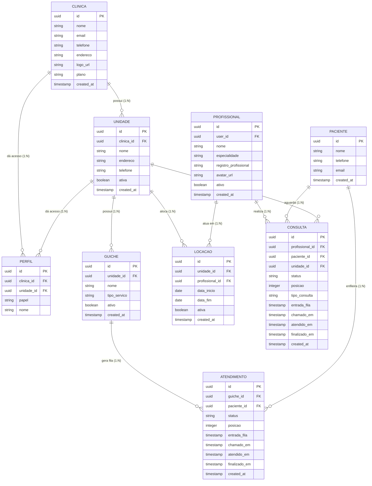
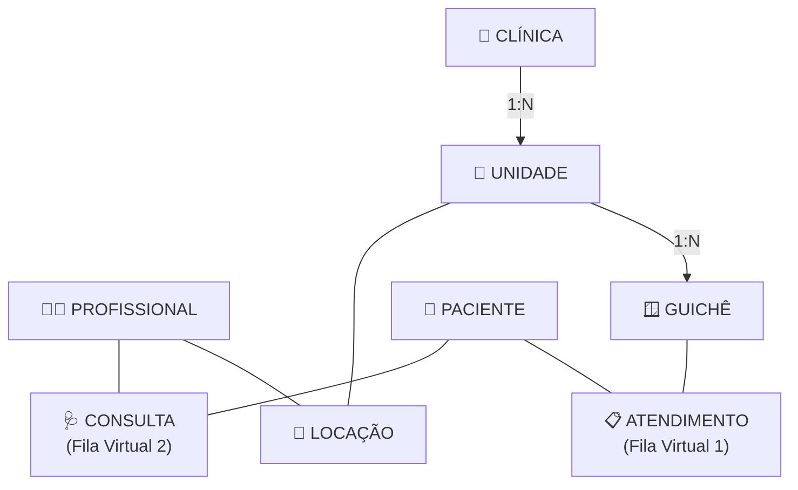
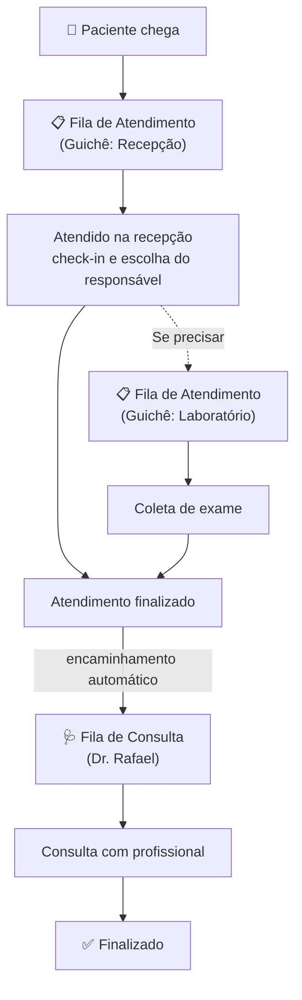
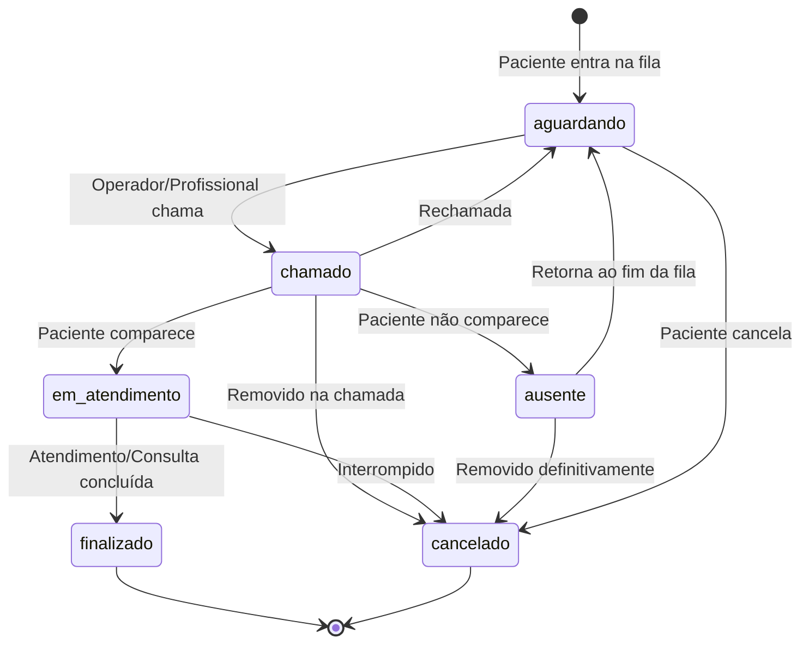

# 🚶 Aguard.ai — Entrega 02

> **Disciplina:** Engenharia de Software 3
>
> **Projeto:** Aguard.ai — Fila Virtual para Clínicas

---

## 1. Objetivo

Revisar e detalhar o modelo de entidades e relacionamentos do Aguard.ai, corrigindo a modelagem inicial para refletir:

- Relação **N:N** entre Profissional e Unidade (via tabela **Locação**)
- Duas filas virtuais distintas:
  - **Fila de Atendimento** (Guichê ↔ Paciente, via tabela **Atendimento**)
  - **Fila de Consulta** (Profissional ↔ Paciente, via tabela **Consulta**)

---

## 2. Modelo de Entidades e Relacionamentos

### 2.1 Diagrama ER



### 2.2 Diagrama de Hierarquia



---

## 3. Entidades Principais

### 3.1 CLÍNICA

Entidade raiz do sistema. Representa a organização que contrata o Aguard.ai.

| Campo | Tipo | Descrição |
|-------|------|-----------|
| `id` | UUID (PK) | Identificador único |
| `nome` | string | Nome da clínica |
| `email` | string | E-mail de contato |
| `telefone` | string | Telefone de contato |
| `endereco` | string | Endereço completo |
| `logo_url` | string | URL da logo |
| `plano` | enum | Plano contratado (starter, pro, business, enterprise) |
| `created_at` | timestamp | Data de criação |

**Regras:**
- Uma clínica possui **uma ou mais** unidades.
- O administrador da clínica é o usuário que a cadastrou (vinculado via `auth.users` do Supabase).

---

### 3.2 UNIDADE

Filial ou local de atendimento. Pertence a uma única clínica.

| Campo | Tipo | Descrição |
|-------|------|-----------|
| `id` | UUID (PK) | Identificador único |
| `clinica_id` | UUID (FK → CLINICA) | Clínica à qual pertence |
| `nome` | string | Nome da unidade |
| `endereco` | string | Endereço da unidade |
| `telefone` | string | Telefone da unidade |
| `ativa` | boolean | Se a unidade está ativa |
| `created_at` | timestamp | Data de criação |

**Regras:**
- Uma unidade possui **um ou mais** guichês.
- Uma unidade pode ter **vários profissionais** alocados (via Locação).
- Um profissional pode atuar em **várias unidades**.

---

### 3.3 PROFISSIONAL

Médico, dentista ou outro profissional de saúde que realiza consultas.

| Campo | Tipo | Descrição |
|-------|------|-----------|
| `id` | UUID (PK) | Identificador único |
| `user_id` | UUID (FK → auth.users) | Conta de login |
| `nome` | string | Nome completo |
| `especialidade` | string | Especialidade (ex: Odontologia, Dermatologia) |
| `registro_profissional` | string | CRM, CRO, etc. |
| `avatar_url` | string | Foto de perfil |
| `ativo` | boolean | Se está ativo |
| `created_at` | timestamp | Data de criação |

**Regras:**
- Pode atuar em **múltiplas unidades** de uma mesma clínica (via Locação).
- Possui sua **própria fila de consultas** (Fila Virtual 2).
- Acessa o painel de atendimento para chamar pacientes.

---

### 3.4 GUICHÊ

Ponto físico de atendimento dentro de uma unidade (recepção, balcão, sala).

| Campo | Tipo | Descrição |
|-------|------|-----------|
| `id` | UUID (PK) | Identificador único |
| `unidade_id` | UUID (FK → UNIDADE) | Unidade à qual pertence |
| `nome` | string | Identificador do guichê (ex: "Guichê 1", "Sala 3") |
| `tipo_servico` | string | Tipo de serviço oferecido (ex: "Recepção", "Coleta") |
| `ativo` | boolean | Se está ativo |
| `created_at` | timestamp | Data de criação |

**Regras:**
- Pertence a **uma única** unidade.
- Possui sua **própria fila de atendimentos** (Fila Virtual 1).
- Limitado pelo plano da clínica.

---

### 3.5 PACIENTE

Usuário final que entra nas filas virtuais.

| Campo | Tipo | Descrição |
|-------|------|-----------|
| `id` | UUID (PK) | Identificador único |
| `nome` | string | Nome do paciente |
| `telefone` | string | Telefone para contato/notificação |
| `email` | string (opcional) | E-mail |
| `created_at` | timestamp | Data de criação |

**Regras:**
- Não requer login — identificado por dados básicos ao entrar na fila.
- Pode estar em **múltiplas filas** simultaneamente (atendimento e consulta).
- Acessa o sistema exclusivamente via rotas públicas (link/QR Code).

---

## 4. Tabelas Intermediárias (Relacionamentos N:N)

### 4.1 LOCAÇÃO (Unidade ↔ Profissional)

Registra a alocação de um profissional em uma unidade. Permite que o mesmo profissional atue em várias unidades da mesma clínica.

| Campo | Tipo | Descrição |
|-------|------|-----------|
| `id` | UUID (PK) | Identificador único |
| `unidade_id` | UUID (FK → UNIDADE) | Unidade |
| `profissional_id` | UUID (FK → PROFISSIONAL) | Profissional |
| `data_inicio` | date | Início da alocação |
| `data_fim` | date (nullable) | Fim da alocação (null = vigente) |
| `ativa` | boolean | Se a locação está ativa |
| `created_at` | timestamp | Data de criação |

**Exemplo:** Dr. Rafael (dentista) atende na Unidade Centro às segundas e quartas, e na Unidade Shopping às terças e quintas.

---

### 4.2 ATENDIMENTO (Guichê ↔ Paciente) — Fila Virtual 1

Registra a entrada de um paciente na fila de um guichê específico. É a **fila de atendimento geral** — usada para serviços como recepção, coleta de exames, triagem.

| Campo | Tipo | Descrição |
|-------|------|-----------|
| `id` | UUID (PK) | Identificador único (ticket) |
| `guiche_id` | UUID (FK → GUICHE) | Guichê |
| `paciente_id` | UUID (FK → PACIENTE) | Paciente |
| `status` | enum | `aguardando`, `chamado`, `em_atendimento`, `ausente`, `finalizado`, `cancelado` |
| `posicao` | integer | Posição na fila |
| `entrada_fila` | timestamp | Quando entrou na fila |
| `chamado_em` | timestamp (nullable) | Quando foi chamado |
| `atendido_em` | timestamp (nullable) | Quando o atendimento iniciou |
| `finalizado_em` | timestamp (nullable) | Quando finalizou |
| `created_at` | timestamp | Data de criação |

**Cenários de uso:**
- Paciente chega na clínica e entra na fila da **recepção** (Guichê 1)
- Paciente precisa fazer **coleta de sangue** (Guichê "Laboratório")
- Paciente aguarda **triagem** antes da consulta

---

### 4.3 CONSULTA (Profissional ↔ Paciente) — Fila Virtual 2

Registra a entrada de um paciente na fila de um profissional específico. É a **fila de consulta** — usada para atendimento com médico, dentista, etc.

| Campo | Tipo | Descrição |
|-------|------|-----------|
| `id` | UUID (PK) | Identificador único (ticket) |
| `profissional_id` | UUID (FK → PROFISSIONAL) | Profissional |
| `paciente_id` | UUID (FK → PACIENTE) | Paciente |
| `unidade_id` | UUID (FK → UNIDADE) | Unidade onde a consulta ocorre |
| `status` | enum | `aguardando`, `chamado`, `em_atendimento`, `ausente`, `finalizado`, `cancelado` |
| `posicao` | integer | Posição na fila |
| `tipo_consulta` | string | Tipo da consulta (ex: "Retorno", "Primeira vez") |
| `entrada_fila` | timestamp | Quando entrou na fila |
| `chamado_em` | timestamp (nullable) | Quando foi chamado |
| `atendido_em` | timestamp (nullable) | Quando o atendimento iniciou |
| `finalizado_em` | timestamp (nullable) | Quando finalizou |
| `created_at` | timestamp | Data de criação |

**Cenários de uso:**
- Paciente entra na fila do **Dr. Rafael** (consulta odontológica)
- Paciente aguarda a **Dra. Ana** para retorno dermatológico
- Profissional gerencia **sua própria fila** independente dos guichês

---

### 4.4 Campos Acrescentados na Implementação

| Entidade | Campos | Para quê |
|----------|--------|----------|
| Todas | `created_at/by`, `updated_at/by`, `deleted_at/by` | Auditoria e soft delete |
| PERFIL | `id` (= `auth.users`), `clinica_id`, `unidade_id`, `papel` | Papel de acesso e escopo do RLS |
| PROFISSIONAL | `clinica_id`, `codigo`, `duracao_media_minutos` | Multi-tenant, senha da fila e estimativa de espera |
| GUICHE | `codigo`, `duracao_media_minutos`, `encaminha_para_consulta`, `profissional_padrao_id` | Senha, estimativa e encaminhamento automático |
| ATENDIMENTO | `senha`, `numero_senha`, `data_fila`, `prioridade`, `encaminhar_para_consulta`, `proximo_profissional_id`, `tipo_consulta`, `consulta_gerada_id` | Ticket, fila do dia, preferencial e ligação com a Fila 2 |
| CONSULTA | `senha`, `numero_senha`, `data_fila`, `prioridade`, `origem_atendimento_id` | Ticket, fila do dia, preferencial e rastreio da origem |
| PLANO_LIMITE | limites por plano e preço simulado | Monetização simulada |
| FILA_EVENTO | histórico append-only das transições | Auditoria das duas filas |

---

## 5. Duas Filas Virtuais

### 5.1 Comparação

| Aspecto | Fila de Atendimento (1) | Fila de Consulta (2) |
|---------|------------------------|---------------------|
| **Tabela** | ATENDIMENTO | CONSULTA |
| **Vínculo** | Guichê ↔ Paciente | Profissional ↔ Paciente |
| **Quem gerencia** | Clínica e Unidade | Profissional (e os gestores da unidade) |
| **Uso típico** | Recepção, coleta, triagem | Consulta médica, odontológica |
| **Entrada** | QR Code do guichê/unidade | Encaminhamento automático ou QR Code do profissional |
| **Prioridade** | Preferencial, depois ordem de chegada | Preferencial, depois ordem de chegada |

### 5.2 Fluxo Combinado Típico

O profissional **não enxerga a Fila 1**. O paciente só aparece para ele quando o
atendimento no guichê é finalizado — é nesse momento que o responsável é definido,
em `atendimento.proximo_profissional_id` ou, na ausência dele, no
`guiche.profissional_padrao_id`. A criação da consulta é automática (trigger
`fn_encaminhar_para_consulta`).



O vínculo entre os dois tickets fica registrado nos dois sentidos:
`atendimento.consulta_gerada_id` e `consulta.origem_atendimento_id`. A tela pública
de acompanhamento usa esse vínculo para redirecionar o paciente do ticket do guichê
para o ticket da consulta sem que ele precise fazer nada.

---

## 6. Diagrama de Estados (Compartilhado)

Ambas as filas (Atendimento e Consulta) compartilham o mesmo ciclo de estados:



O banco recusa qualquer transição fora deste diagrama (`fn_transicao_valida`).
`finalizado` e `cancelado` são terminais. O retorno `ausente → aguardando` renova
`entrada_fila`, jogando o paciente para o fim da fila.

---

## 7. Impacto nas Rotas e Navegação

### Rotas completas

| Rota | Tipo | Descrição |
|------|------|-----------|
| `/(auth)/unidades` | Autenticada | Lista de unidades |
| `/(auth)/unidades/nova` | Autenticada | Criar unidade |
| `/(auth)/unidades/[id]` | Autenticada | Ver unidade + guichês vinculados |
| `/(auth)/unidades/[id]/editar` | Autenticada | Editar unidade |
| `/(auth)/profissionais` | Autenticada | Lista de profissionais |
| `/(auth)/profissionais/novo` | Autenticada | Cadastrar profissional |
| `/(auth)/profissionais/[id]` | Autenticada | Ver profissional + locações |
| `/(auth)/profissionais/[id]/editar` | Autenticada | Editar profissional |
| `/(auth)/locacoes` | Autenticada | Gestão de alocação de profissionais por unidade |
| `/(auth)/atendimento` | Autenticada | Painel de fila. Gestores veem as duas filas; o profissional vê apenas as consultas dele |
| `/(auth)/atendimento/historico` | Autenticada | Histórico de atendimentos e consultas |
| `/(public)/fila/[guicheId]` | Pública | Entrada na fila virtual do guichê (recepção) |
| `/(public)/acompanhar/[ticketId]` | Pública | Acompanhar posição na fila (Guichê → Consulta automática) |

### Sidebar atualizada (Clínica)

```
📊 Dashboard              → /(auth)/dashboard
🏥 Minha Clínica          → /(auth)/clinica
🏢 Unidades               → /(auth)/unidades
👨‍⚕️ Profissionais         → /(auth)/profissionais
📌 Locações               → /(auth)/locacoes
📋 Filas                   → /(auth)/filas
📈 Relatórios              → /(auth)/relatorios
```

### Sidebar atualizada (Unidade)

```
📊 Dashboard              → /(auth)/dashboard
👨‍⚕️ Profissionais         → /(auth)/profissionais   (somente leitura)
📋 Filas                   → /(auth)/filas
📺 Atendimento             → /(auth)/atendimento
📈 Relatórios              → /(auth)/relatorios
```

### Sidebar atualizada (Profissional)

```
📺 Minha Fila              → /(auth)/atendimento
📜 Histórico               → /(auth)/atendimento/historico
```

---

## 8. Canais Realtime (Supabase)

| Canal | Evento | Quem escuta |
|-------|--------|-------------|
| `atendimento:guiche:{guicheId}` | Novo paciente, chamada, mudança de status | Operador do guichê, Paciente |
| `consulta:profissional:{profId}` | Novo paciente, chamada, mudança de status | Profissional, Paciente |
| `unidade:{unidadeId}` | Resumo de filas da unidade | Dashboard da Clínica |
| `clinica:{clinicaId}` | Métricas agregadas | Dashboard da Clínica |

---

## 9. Regras de Negócio

1. Um **Profissional** pode estar alocado em múltiplas unidades, mas a locação tem período de vigência (`data_inicio`, `data_fim`).
2. O **Guichê** possui fila própria (Atendimento). Quem opera o guichê é a Clínica ou a Unidade — não precisa ser um profissional cadastrado.
3. A **Consulta** está sempre vinculada a um profissional e a uma unidade, e só é criada se o profissional tiver **locação vigente** naquela unidade.
4. O **Profissional** vê apenas a **fila de consulta dele**. Ele não enxerga a Fila 1: o paciente aparece quando o atendimento no guichê termina e o encaminhamento o define como responsável.
5. O **Paciente** acompanha apenas **uma fila por vez**. A tela de acompanhamento é única, resolve o tipo de fila internamente e migra sozinha do ticket do guichê para o da consulta.
6. O **plano da clínica** limita unidades, guichês, profissionais e o volume mensal de tickets (atendimentos + consultas).
7. Cada fila tem **posição** gerenciada independentemente — a posição na fila do Guichê 1 não afeta a posição na fila do Dr. Rafael. Pacientes **preferenciais** vêm antes, e a renumeração é automática a cada entrada, chamada, ausência ou cancelamento.
8. Cada ticket recebe uma **senha sequencial diária** por guichê ou por profissional (`REC1-007`, `RAF-004`).
9. Nenhum registro é apagado: `DELETE` vira **soft delete** e toda tabela guarda quem criou, alterou e removeu. As transições de status ficam em `fila_evento`, que é somente de inserção.
10. O **Paciente** não tem login e nunca acessa as tabelas: entra, acompanha e cancela apenas por funções RPC. Os painéis públicos de sala de espera exibem o nome mascarado ("Maria S."), sem telefone nem e-mail.

## 10. Papéis de Acesso

Além do Paciente (anônimo), três papéis autenticados, registrados em `perfil`
(espelho de `auth.users` com `papel`, `clinica_id` e `unidade_id`):

| Papel | O que faz |
|-------|-----------|
| **CLINICA** | Administração. Único papel que gere clínica, unidades, locações e o cadastro de profissionais. Enxerga todas as unidades |
| **UNIDADE** | Operação. Faz o que a clínica faz, restrito à sua unidade: guichês, as duas filas, pacientes, histórico e relatórios. **Vê** os profissionais alocados nela, mas não os cadastra, edita nem remaneja |
| **PROFISSIONAL** | Apenas a própria fila de consulta e o cadastro dele mesmo |

Regras de escopo:

1. A **UNIDADE é filha da CLINICA**: herda o comportamento dela dentro do próprio escopo, menos clínicas, unidades e locações.
2. **Remanejar profissional entre unidades é exclusivo da CLINICA**, porque o vínculo é a Locação.
3. O acesso é aplicado no banco por **Row Level Security**, não só na interface. Cada papel enxerga apenas as linhas do seu escopo, inclusive nos relatórios.
4. Usuários de unidade são criados pela administração da clínica (`fn_vincular_usuario`).
